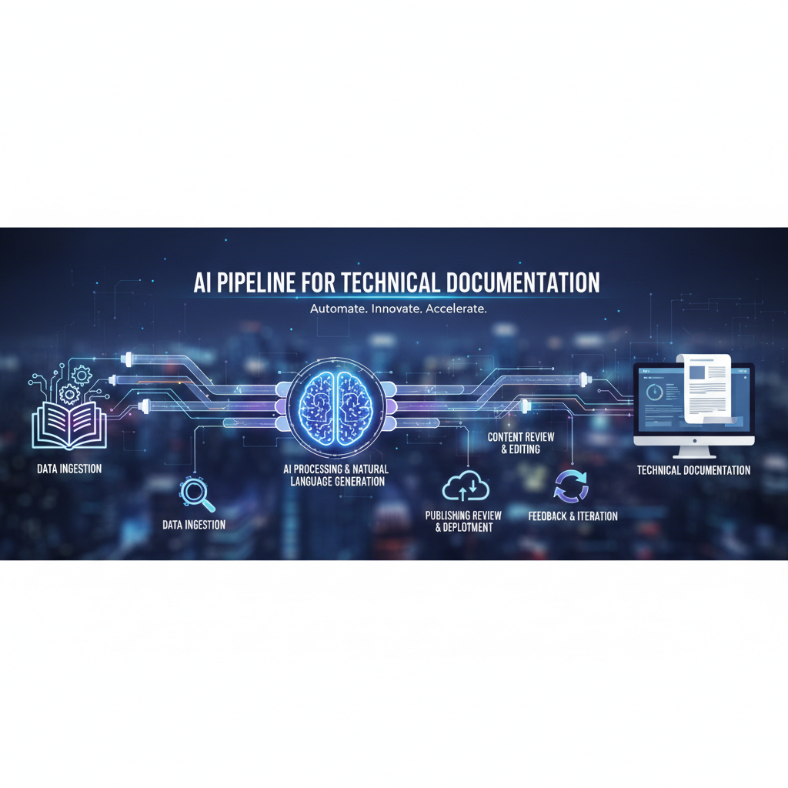

# AI Pipeline for Technical Documentation

This repository is a progressive, hands-on project focused on building **automated documentation pipelines** for technical products.

The goal is not to showcase a finished AI product, but to demonstrate **how documentation systems evolve** _(starting from basic automation and gradually incorporating AI in a controlled, explainable way.)_

The project mirrors how real teams introduce AI into thier documentation workflows: ***carefully, incrementally***, but more importantly, with ***human oversight.***



------------------------------------------------------------------------

## What this repository demonstrates

This project focuses on:

- Designing **end-to-end documentation pipelines**
- Working with **structured technical inputs**
- Generating **consistent, repeatable documentation outputs**
- Understanding WHERE ***AI adds value***, and WHERE it should be **Governed**
- Balancing **developer experience (DX)** with broader technical user needs

APIs are used as the first example input, but the pipeline is intentionally designed to be extensible to other technical documentation domains.

------------------------------------------------------------------------

## Current project state (Phase 1)

At its current stage, this repository contains a **fully working,
non-AI documentation pipeline**.

The pipeline:

- Reads a structured OpenAPI (Swagger) YAML file
- Extracts relevant technical information
- Generates Markdown documentation
- Writes the output to a version-controlled folder
- Produces deterministic, reproducible results

This phase establishes a strong foundation before introducing AI.

------------------------------------------------------------------------

## Repository structure

```
ai-doc-pipeline/
│
├── AI Pipeline Code/
│   └── pipeline.py           # SOURCE: documentation pipeline logic
│
├── API Specs/                # INPUT: structured technical specs
│   └── payments_api.yaml
│
├── Generated Docs/           # OUTPUT: generated documentation
│   ├── .gitkeep
│   └── api.md
│
├── README.md
├── LICENSE
```

Each folder has a clear responsibility:
- **Source**: how documentation is generated
- **Input**: what is being documented
- **Output**: what users ultimately read

------------------------------------------------------------------------

## How to run the pipeline (current version)

From the repository root:

```bash
python3 "AI Pipeline Code/pipeline.py"
```

After running:
- A Markdown file is generated inside `Generated Docs/`
- The output can be reviewed, committed, and published

No AI configuration is required at this stage.

------------------------------------------------------------------------

## Planned project progression

This repository is intentionally developed in **clear phases**, similar to
a learning playground or internal tooling evolution.

### Phase 1 — Deterministic pipeline (current)
- Structured input → Markdown output
- No AI
- Focus on correctness and reproducibility

### Phase 2 — AI-assisted API documentation
- Improve clarity, structure, and examples using AI
- AI augments the pipeline, not replaces it
- Strong focus on developer experience (DX)

### Phase 3 — Multiple input types
- Extend beyond APIs to:
  - SDKs / libraries
  - CLI tools
  - Configuration schemas
- Same pipeline, different parsers

### Phase 4 — Audience-aware documentation
- Generate documentation tailored for:
  - Developers
  - Product or platform users
  - Internal engineering teams

### Phase 5 — Documentation governance
- Style and terminology consistency
- Detection of ambiguity or drift
- Human-in-the-loop review patterns

------------------------------------------------------------------------

## Why this project exists

This repository exists to explore:

- How technical documentation systems scale
- How AI fits into real documentation workflows
- How structure enables better automation
- How writers, DX engineers, and product teams collaborate through tooling

The emphasis is on **reasoning, structure, and evolution**, not just output.

------------------------------------------------------------------------

## About the approach

- Each phase builds on the previous one
- Complexity is introduced gradually
- Decisions are intentional and documented
- The project remains understandable at every stage

This mirrors how documentation platforms and internal tooling are built
in real organizations.

------------------------------------------------------------------------

## Notes

All examples use simplified or fictional specifications.
This repository is intended for learning, experimentation, and portfolio
demonstration — not as a production-ready documentation system.
